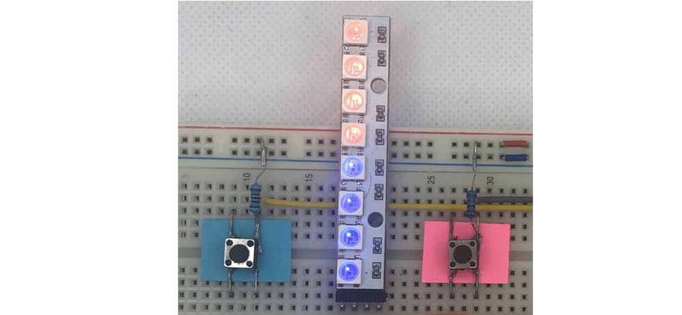

# Click Count

This application is counting clicks from two push buttons and showing result on a LED strip. You may use it to check who is a faster clicker.

## The Story

Preparing a training on what is a logic analyzer I needed a simple example when this tool may be useful. I decided to prepare an application to count clicks from two push buttons (PB), show how counting may get completely wrong because of bouncing PB contacts and demonstrate using a logic analyzer to troubleshoot this issue.

## How to Use

Probably the most convenient way to develop (write, compile, load, and debug) applications for Espressif chips with ESP-IDF is by using [VS Code](https://marketplace.visualstudio.com/items?itemName=espressif.esp-idf-extension) or [Eclipse](https://github.com/espressif/idf-eclipse-plugin/blob/master/README.md) that are free IDEs available for Windows, Linux and macOS . Please follow one of the linked IDE guides to compile and load the application to an ESP board.

## Compatibility

This example has been tested with [ESP-IDF v4.4](https://docs.espressif.com/projects/esp-idf/en/stable/esp32/index.html) and run on [ESP32-PICO-KIT](https://docs.espressif.com/projects/esp-idf/en/stable/esp32/hw-reference/esp32/get-started-pico-kit.html) board. The application is generic and should run on other versions of ESP-IDF and on other boards with [ESP32-x chips supported by ESP-IDF](https://github.com/espressif/esp-idf#esp-idf-release-and-soc-compatibility) (using of different pin numbers may be required).

## Required Hardware

1. ESP32-x board with at least four exposed and unused GPIO pins. 
2. Two push buttons / tact switches. 
3. Two 5 kΩ resistors (any resistors in range of 1 ~ 20 kΩ should be fine)
4. WS2812 LED strip with eight LEDs
5. Breadboard and some wires to make connections
6. Logic analyzer

**Notes:**

- Ad. 1 In this particular case I am using [ESP32-PIC-KIT](https://docs.espressif.com/projects/esp-idf/en/latest/esp32/hw-reference/esp32/get-started-pico-kit.html) because it is quite narrow leaving two free rows of connecting contacts on a typical breadboard.
- Ad. 2 Pins of tact switches are relatively short and may not provide good contact with the breadboard terminals. Therefore, to extend the pins, I have soldered jumper wires as well as pull up resistor to the pins of each switch.
- Ad. 3 The resistors act as pull ups for the push buttons.
- Ad. 4 Using a longer strip is also possible. To do so you need to change `8` to the actual number of LEDs of the strip in the following line of [click-count.c](main/click-count.c) application: 

	```c
	pStrip_a = led_strip_init(LED_STRIP_RMT_CHANNEL, LED_STRIP_GPIO, 8);
	```
	Besides that you need to update the code turning on red and blue LEDs depending on the number of counted clicks. The code is located inside `while(1)` loop below the following comment of [click-count.c](main/click-count.c): 

	```c
	/* Show on LCD strip count of clicks by blue and red buttons */
	```

See the picture below of how the hardware assembled on a breadboard.


## Hardware Connections

The example code is configured for the following connections:

| ESP32 Pin | Direction | Description of Pin Functionality |
|---|---|---|
| GPIO33 | Output | LED strip signal input |
| GPIO18 | Input | Input from Blue push button |
| GPIO22 | Input | Input from Red push button |
| GPIO38 | Input | Selection input used to define if to debounce the push buttons. |

**Note:**

- Ad. GPIO38: connect this pin to ground to skip debouncing or to 3.3 V to add debouncing. 

See the picture below of how the connections look with real hardware.


## Counting the Clicks -- A Simple Way

### The Algorithm

The [click-count.c](main/click-count.c) application counts clicks by waiting for a change of signal level on a GPIO connected to a push button. The GPIO is scanned specifically for a high-to-low or low-to-high signal changes. After detecting a change in one direction, the scanning is continued by waiting for a signal change in the opposite direction. The process is executed in a loop in two steps tracked using `seq_step` variable.

1. In the first step the algorithm is waiting in a loop for a low level on a GPIO.

	```c
	if (seq_step == PBS_WAIT_FOR_LOW) {
	    if (gpio_get_level(pb_data->gpio) == 0) {
	        seq_step = PBS_WAIT_FOR_HIGH;
	    }
	}
	```

2. After detecting the low level, the algorithm is moving to the second step and waiting for the GPIO reading the high level:

	```c
	if (seq_step == PBS_WAIT_FOR_HIGH) {
	    if (gpio_get_level(pb_data->gpio) == 1) {
	        seq_step = PBS_WAIT_FOR_LOW;
	        pb_data->counter++;
	    }
	}
	```

Once the the high level is detected, the algorithm increments the click `counter` and moves back to the step one.

There is one extra and important piece of code to delay the loop execution every `255` iteration so the other tasks, e.g. scanning for a different button, have a chance to run.

```c
if (loop_count++ == 255) {
    vTaskDelay(PBS_LOOP_IDDLE_MS / portTICK_PERIOD_MS);
}
```

**A Spoiler Note:** In my first version of this algorithm the delay was done on each loop iteration. As it turned out such a delay was sufficient to debounce the push button. But the idea was to provide more explicit deboucing what will be described later. 


### Check the Application

Let's load the application and check how it works. 

**Note:** Before clicking the buttons connect GPIO38 to the ground and reset the board. Then the click counting will be done using algorithm discussed above.

On each click of the blue button, the number of blue LEDs on should increase by one, the same should happen when clicking the red button, the number of red LEDs on should increase.



Clicking the buttons couple of times you are likely to discover that the counting in on some occasions is incorrect. After a single click, two or more LEDs of a given color may randomly turn on. The reason what this happens should be obvious after checking the signals from the buttons with a logic analyzer.

### Check the Signals

Connect a logic analyzer to the signals from push buttons hooked to GPIO18 and GPIO22 and randomly click both push buttons. Then check the waveform collected by the analyzer:


Once zooming in to the signal edges you should be able to see that the signals do not cleanly change from one state to another on each button clink but randomly bouncing between high and low level:


This is result of vibration/bouncing of the button contacts that happens randomly on each click. As a result the click count reported by the application will be bigger than the number of physical clicks of the button.

## Debouncing - It is not Complicated

There are multiple ways to resolve the issue of bouncing contacts depending on button type and the application. Check [_A Guide to Debouncing_ by Jack G. Ganssle](https://my.eng.utah.edu/~cs5780/debouncing.pdf) for a detailed description and examples. In our case we will resolve the issue by modifying the click reading algorithm to wait over the period the contacts are bouncing.

Basing on the waveform from the logic analyzer collected before, the longest period the contact are bouncing is about 100 μs. Therefore, after detecting a signal change from a push button, and before checking for the signal change in the opposite direction, we should wait for at least 100 μs. Otherwise we may detect changes from bouncing contacts rather than from a "legitimate" click.

The period waiting should assume some safety margin. Also 100 μs looks quite short comparing to periods quoted in [_A Guide to Debouncing_](https://my.eng.utah.edu/~cs5780/debouncing.pdf). To be on a safe site let's take 10 ms as the waiting time for the contact debouncing. 

### Improved Algorithm

The original algorithm for counting clicks discussed above should be then extended by one extra step to account for the period the contacts are bouncing. The complete algorithm will look as follows:

1. The first step is functionally the same as in the original algorithm and provides for waiting in a loop for a low level on a GPIO.

	```c
	if (seq_step == PBS_WAIT_FOR_LOW) {
	    if (gpio_get_level(pb_data->gpio) == 0) {
	        previous_time_stamp = xTaskGetTickCount();
	        seq_step = PBS_DEBOUCE_WAIT;
	    }
	}
	```

2. Now we need to account for the time the contracts are bouncing by waiting for the period of 10 ms defined `PB_DEBOUNCE_DELAY_MS`. 

	```c
	if (seq_step == PBS_DEBOUCE_WAIT) {
	    if (xTaskGetTickCount() - previous_time_stamp >= PB_DEBOUNCE_DELAY_MS) {
	        seq_step = PBS_WAIT_FOR_HIGH;
	    }
	}
	```

3. Only after `PB_DEBOUNCE_DELAY_MS` period expires we may move to the next step, that is functionally the same as in the original algorithm, and wait for high level on the GPIO:

	```c
    if (seq_step == PBS_WAIT_FOR_HIGH) {
        if (gpio_get_level(pb_data->gpio) == 1) {
            seq_step = PBS_WAIT_FOR_LOW;
            pb_data->counter++;
        }
    }
	```

### Check the Improved Algorithm

**Note:** Before clicking the buttons connect GPIO38 to the 3.3V and reset the board. Then the click counting will be done using the improved algorithm.

To check if there are no more false click counting, press the blue and the red buttons the same number of times in turns and check if the number of blue and red LEDs on the strip stays the same.

You may go even further and attach a pair or relays in parallel to the button contacts. The relays may be controlled from another ESP board to simulate the clicks. The relay contacts will bounce as well! 

## Conclusion

Reading the state of push button, switch, relay or any other mechanical contacts with a microcontroller should account for the contact bouncing. If the bouncing is ignored, we are likely to read additional and random unwanted signals from the contacts.

The algorithm reading signals from contacts, that accounts for the contact bouncing, consists of three steps: 

- Waiting for the signal transition in one direction, 
- Waiting for the period the contact will bounce. The period should contain some safety margin.
- Finally, waiting for the signal transition in the opposite direction.

To assess the bouncing period refer to the product datasheet (see an example below). 


If the datasheet is not available you may assume the period in range of 10 ~ 20 ms or make some measurements by yourself. 

If you find this topic interesting, check other materials available on bouncing from reputable sources. Besides implementing an algorithm in a microcontroller there several other ways to damp, eliminate or account for bouncing. There are also specialized chips to eliminate bounces, e.g. MC14490.

## Contribute

Feel free to contribute to the project in any way you like!

If you find any issues with code or description please report them using *Issues* tab above.

## Acknowledgments

I got a lot of inspiration from a very comprehensive and classic [_A Guide to Debouncing_ by Jack G. Ganssle](https://my.eng.utah.edu/~cs5780/debouncing.pdf). 